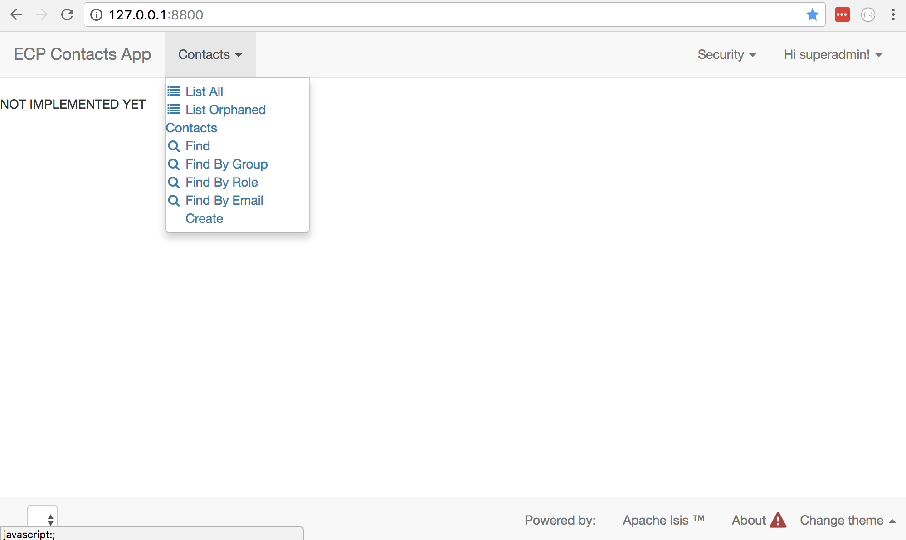

# AngularViewer for Restful obejcts
Angular 2 viewer to render domain models following the [Restful Object specification]("http://www.restfulobjects.org/")

 ## To execute:
    npm start 

## Port number
The application will try to start on port 8800. If this port is not free, it will randomly choose a free port.
To explicitly change this open `packages.config` and change the port number in the `start` script.

    "scripts": {
        "start": "live-server --port=8800"
     }

# Screenshots
## Home Page 
### Canvas

### Primary menu bar

### Secondary menu bar

### Tertiary menu bar
